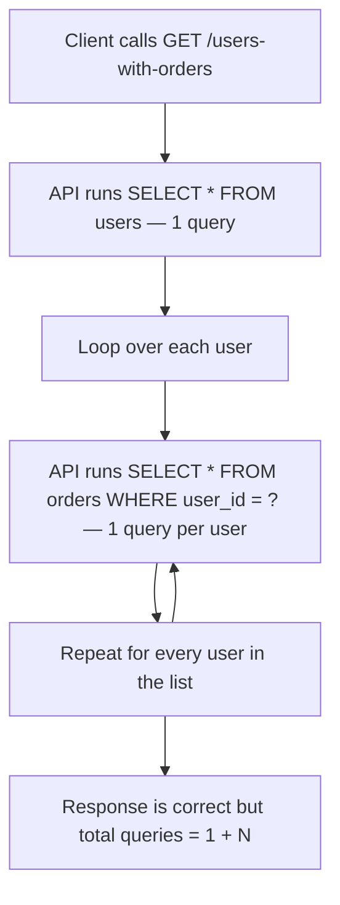
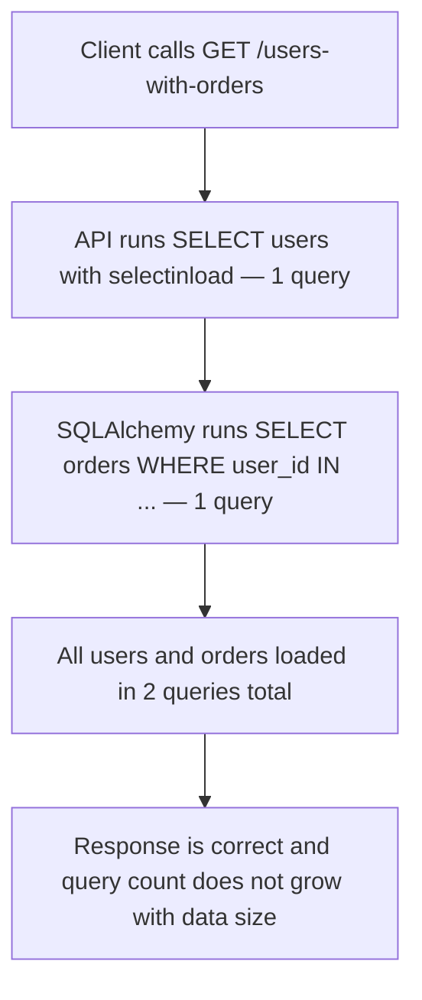

<p align="right">
  <a href="README.md">English</a> |
  <a href="README.ru.md">Русский</a>
</p>

# N+1 Queries Hidden Behind a Simple Endpoint

## Summary

A simple endpoint returns users with their orders, but the broken implementation runs one extra SQL query per user.

The response looks correct on small data. The failure is hidden in the number of database queries.

## Metadata

- ID: `BFL-0002`
- Category: `database-transactions`
- Secondary category: `performance-scaling`
- Level: `junior`
- Technologies: `python`, `fastapi`, `postgresql`, `sqlalchemy`, `pytest`
- Failure modes: `slow-query`
- Patterns: `eager-loading`
- Status: `draft`

## Problem

The API exposes an endpoint:

```http
GET /users-with-orders
```

It should return users and their orders.

The broken implementation first loads all users, then loads orders separately for each user. With 5 users this is easy to miss. With 10,000 users it becomes a production incident.

## Why This Happens in Production

N+1 queries often appear when code is written around objects instead of data access patterns.

The endpoint looks natural:

1. load users;
2. loop over users;
3. load orders for the current user;
4. build the response.

The mistake is that each loop iteration performs another database query.

This usually slips through when tests only check the response body and do not check query count or performance behavior.

## Broken Scenario

1. The database contains 5 users.
2. Each user has one order.
3. The client calls `GET /users-with-orders`.
4. The API loads all users with one query.
5. The API loads orders with one additional query per user.
6. The response is correct, but the endpoint performs `1 + N` SELECT queries.

## Broken Implementation

The broken endpoint loads users first:

```python
users = get_users(session)
```

Then it loops over every user and loads orders separately:

```python
for user in users:
    orders = get_orders_for_user(session=session, user_id=user.id)
```

The response is correct, but the query pattern is not.

## Where the Bug Happens

The bug happens in the boundary between response building and data loading.

In `broken/app.py`, the endpoint builds the response in a loop. Inside that loop it calls `get_orders_for_user()`.

In `broken/repository.py`, `get_orders_for_user()` runs a SQL query filtered by one `user_id`:

```python
select(Order).where(Order.user_id == user_id)
```

That query is valid for one user. The bug appears when it is called once per user in a list endpoint.

For 5 users, the endpoint does 6 SELECT queries. For 10,000 users, it does 10,001 SELECT queries.

## How to Catch This Bug

Do not only test that the JSON response is correct.

For endpoints that return parent objects with child collections, also check how many SQL queries are executed.

This case uses a SQLAlchemy `before_cursor_execute` event listener in the test to count SELECT statements during the request.

The risky pattern is:

```python
parents = get_parents(session)
for parent in parents:
    children = get_children_for_parent(session, parent.id)
```

The safer pattern is to load the relationship in a bounded number of queries:

```python
select(User).options(selectinload(User.orders))
```

## Failing Test

The failing test creates 5 users and one order for each user.

It calls `GET /users-with-orders` and expects the endpoint to use no more than 2 SELECT queries.

The broken implementation returns the correct response, but it executes 6 SELECT queries, so the test fails.

## Diagnosis

The system fails because correctness and scalability were tested separately.

The response body is correct, but the database access pattern scales with the number of users.

This is the core N+1 failure: every additional parent row causes another child query.

## Fixed Implementation

The fixed implementation loads users and orders with eager loading:

```python
select(User).options(selectinload(User.orders))
```

`selectinload` is a good default for this case because `User -> Order` is a one-to-many relationship. SQLAlchemy first loads the users, then loads all orders for those users with one extra `WHERE user_id IN (...)` query. The endpoint still returns nested users with orders, but query count no longer grows by one query per user.

For a many-to-one relationship, such as `Order -> User`, `joinedload` is often a reasonable option because each order points to one user and joining usually does not multiply rows as aggressively. For one-to-many collections, `joinedload` can duplicate parent rows and make pagination harder. An explicit query is also valid for read-heavy endpoints, but it usually requires more manual response assembly.

## How to Run

From the repository root:

### Broken Version

```bash
make broken CASE=BFL-0002
```

Expected result: this test is expected to fail because the broken implementation performs N+1 queries.

### Fixed Version

```bash
make fixed CASE=BFL-0002
```

Expected result: the tests should pass because the fixed implementation uses eager loading.

## Files

- `broken/` - intentionally inefficient implementation
- `fixed/` - corrected implementation using eager loading
- `tests/` - tests that verify response shape and query count

## Diagrams

Broken flow:



Fixed flow:



## Production Notes

N+1 queries are dangerous because they often stay invisible in development data.

Production signals can include:

- endpoint latency grows with result size;
- database query count spikes for one request;
- database CPU increases while application code looks simple;
- logs show repeated similar SELECT statements.

For real systems, add query-count checks to critical endpoints or use profiling during code review and load testing.

## Trade-Offs

`selectinload` usually works well for one-to-many relationships because it keeps queries bounded without producing a large joined result set.

`joinedload` can be useful for smaller relationships, but it may duplicate parent rows and make pagination harder.

An explicit aggregate query can be better for read-heavy endpoints, but it may make response assembly more manual.
