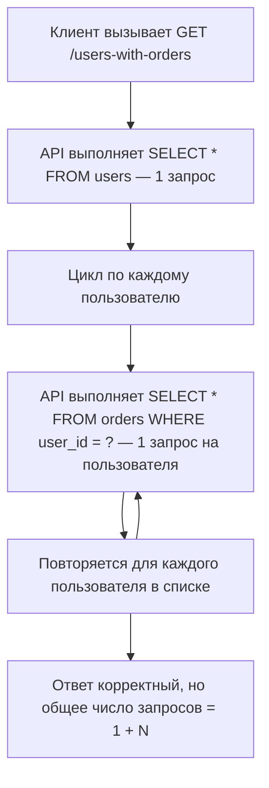
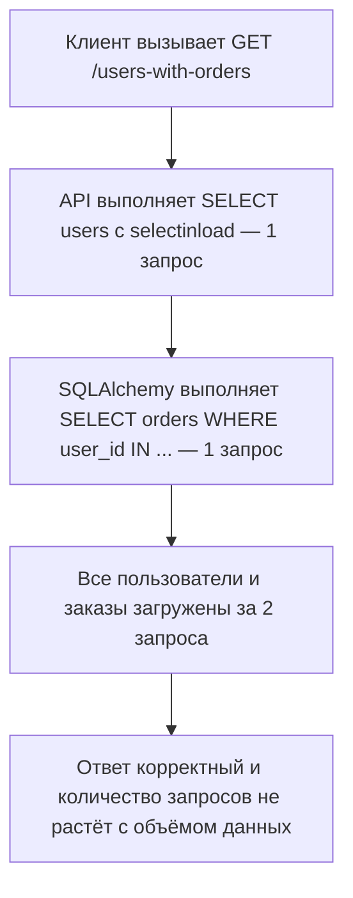

<p align="right">
  <a href="README.md">English</a> |
  <a href="README.ru.md">Русский</a>
</p>

# N+1 queries, спрятанные за простым endpoint

## Краткое описание

Простой endpoint возвращает пользователей и их заказы, но сломанная реализация делает один дополнительный SQL-запрос на каждого пользователя.

Ответ выглядит правильным на маленьких данных. Ошибка спрятана в количестве запросов к базе.

## Metadata

- ID: `BFL-0002`
- Category: `database-transactions`
- Secondary category: `performance-scaling`
- Level: `junior`
- Technologies: `python`, `fastapi`, `postgresql`, `sqlalchemy`, `pytest`
- Failure modes: `slow-query`
- Patterns: `eager-loading`
- Status: `draft`

## Проблема

В API есть endpoint:

```http
GET /users-with-orders
```

Он должен вернуть пользователей и их заказы.

Сломанная реализация сначала загружает всех пользователей, а потом отдельно загружает заказы для каждого пользователя. На 5 пользователях это легко не заметить. На 10 000 пользователях это превращается в production-инцидент.

## Почему это происходит в production

N+1 queries часто появляются, когда код пишут вокруг объектов, а не вокруг схемы доступа к данным.

Endpoint выглядит естественно:

1. загрузить пользователей;
2. пройтись по пользователям циклом;
3. загрузить заказы текущего пользователя;
4. собрать ответ.

Ошибка в том, что каждая итерация цикла делает еще один запрос к базе.

Такой баг часто проходит ревью, если тесты проверяют только тело ответа и не проверяют количество запросов или поведение на росте данных.

## Сценарий бага

1. В базе есть 5 пользователей.
2. У каждого пользователя есть один заказ.
3. Клиент вызывает `GET /users-with-orders`.
4. API загружает всех пользователей одним запросом.
5. API загружает заказы отдельным запросом для каждого пользователя.
6. Ответ правильный, но endpoint выполняет `1 + N` SELECT-запросов.

## Сломанная реализация

Сломанный endpoint сначала загружает пользователей:

```python
users = get_users(session)
```

Потом проходит по каждому пользователю и отдельно загружает его заказы:

```python
for user in users:
    orders = get_orders_for_user(session=session, user_id=user.id)
```

Ответ правильный, но схема запросов неправильная.

## Где именно происходит ошибка

Ошибка происходит на границе между сборкой ответа и чтением данных из базы.

В `broken/app.py` endpoint собирает ответ в цикле. Внутри цикла он вызывает `get_orders_for_user()`.

В `broken/repository.py` функция `get_orders_for_user()` выполняет SQL-запрос для одного `user_id`:

```python
select(Order).where(Order.user_id == user_id)
```

Такой запрос нормален для одного пользователя. Проблема появляется, когда его вызывают один раз на каждого пользователя в списочном endpoint.

Для 5 пользователей endpoint делает 6 SELECT-запросов. Для 10 000 пользователей он сделает 10 001 SELECT-запрос.

## Как отлавливать такую ошибку

Не проверяй только корректность JSON-ответа.

Для endpoints, которые возвращают родительские объекты вместе с дочерними коллекциями, проверяй еще и количество SQL-запросов.

В этом case тест использует SQLAlchemy `before_cursor_execute`, чтобы посчитать SELECT-запросы во время запроса к API.

Опасный паттерн:

```python
parents = get_parents(session)
for parent in parents:
    children = get_children_for_parent(session, parent.id)
```

Более безопасный вариант — загрузить связь ограниченным количеством запросов:

```python
select(User).options(selectinload(User.orders))
```

## Падающий тест

Падающий тест создает 5 пользователей и по одному заказу для каждого пользователя.

Он вызывает `GET /users-with-orders` и ожидает, что endpoint выполнит не больше 2 SELECT-запросов.

Сломанная реализация возвращает правильный ответ, но выполняет 6 SELECT-запросов, поэтому тест падает.

## Диагностика

Система ломается, потому что корректность ответа и масштабируемость проверялись отдельно.

Тело ответа правильное, но схема доступа к базе растет вместе с количеством пользователей.

Это и есть суть N+1: каждая дополнительная родительская запись вызывает еще один запрос за дочерними данными.

## Исправленная реализация

Исправленная реализация загружает пользователей и заказы через eager loading:

```python
select(User).options(selectinload(User.orders))
```

`selectinload` хорошо подходит для этого case, потому что связь `User -> Order` — это one-to-many. SQLAlchemy сначала загружает пользователей, а потом одним дополнительным запросом загружает все заказы для этих пользователей через `WHERE user_id IN (...)`. Ответ все еще содержит пользователей с вложенными заказами, но количество запросов больше не растет на один запрос для каждого пользователя.

Для many-to-one связи, например `Order -> User`, часто подходит `joinedload`, потому что каждый заказ ссылается на одного пользователя и join обычно не раздувает количество строк так сильно. Для one-to-many коллекций `joinedload` может дублировать строки родителей и усложнять pagination. Явный query тоже может быть хорошим решением для read-heavy endpoints, но тогда сборка ответа обычно становится более ручной.

## Как запустить

Из корня репозитория:

### Сломанная версия

```bash
make broken CASE=BFL-0002
```

Ожидаемо: тест должен упасть, потому что сломанная реализация выполняет N+1 queries.

### Исправленная версия

```bash
make fixed CASE=BFL-0002
```

Ожидаемо: тесты должны пройти, потому что исправленная реализация использует eager loading.

## Файлы

- `broken/` - намеренно неэффективная реализация
- `fixed/` - исправленная реализация с eager loading
- `tests/` - тесты, которые проверяют форму ответа и количество запросов

## Диаграммы

Сломанный процесс:



Исправленный процесс:



## Заметки для production

N+1 queries опасны тем, что часто не видны на маленьких dev-данных.

Production-сигналы:

- задержка endpoint растет вместе с размером ответа;
- количество запросов к базе резко растет для одного HTTP-запроса;
- база тратит много CPU, хотя код приложения выглядит простым;
- в логах повторяются похожие SELECT-запросы.

В реальных системах стоит добавлять проверки количества запросов для критичных endpoints или использовать профилирование во время ревью и нагрузочного тестирования.

## Компромиссы

`selectinload` обычно хорошо подходит для связей one-to-many, потому что держит количество запросов ограниченным и не создает большой joined result set.

`joinedload` может быть полезен для небольших связей, но он может дублировать родительские строки и усложнять pagination.

Явный aggregate query может быть лучше для read-heavy endpoints, но сборка ответа станет более ручной.
