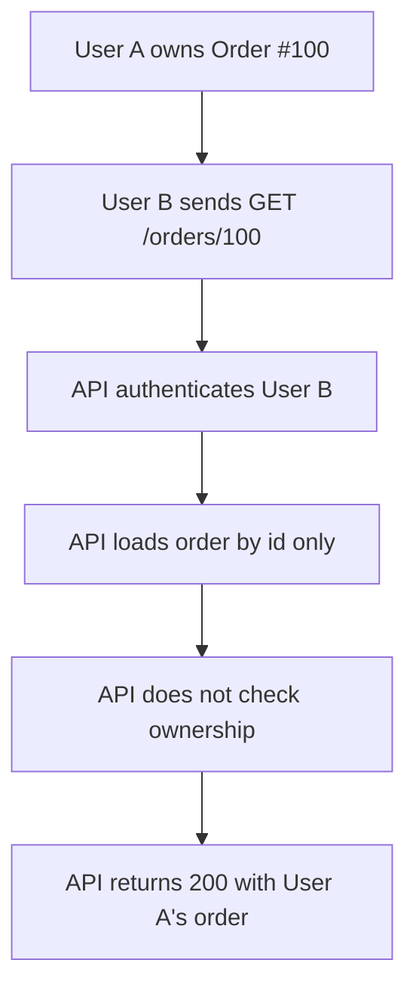
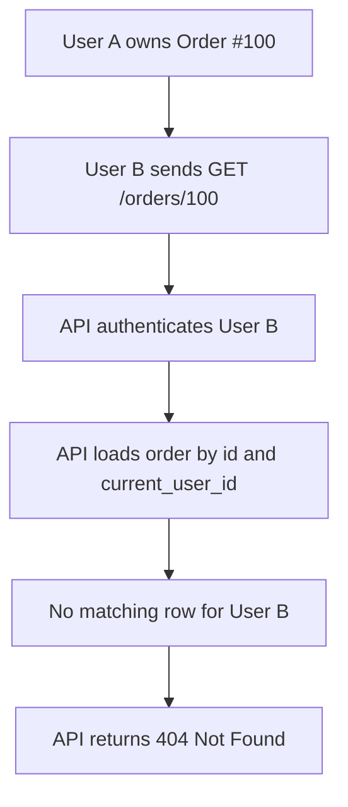

<p align="right">
  <a href="README.md">English</a> |
  <a href="README.ru.md">Русский</a>
</p>

# User Can Read Another User's Order

## Summary

An authenticated user can read an order that belongs to another user.

This case is about a classic object-level authorization bug: the backend checks that the requester is logged in, but does not check that the requested resource belongs to that requester.

## Metadata

- ID: `BFL-0001`
- Category: `security-auth`
- Secondary category: `api-http`
- Level: `beginner`
- Technologies: `python`, `fastapi`, `postgresql`, `sqlalchemy`, `pytest`
- Failure modes: `data-leak`, `broken-authz`
- Status: `released`

## Problem

The API exposes an endpoint for reading an order by ID. The broken implementation loads the order from the database and returns it to any authenticated user.

Authentication is present, but authorization is incomplete. The endpoint does not verify that `order.user_id` matches the current user's ID.

As a result, one user can access another user's private order data by guessing or discovering an order ID.

## Why This Happens in Production

This bug often appears when developers treat authentication as enough protection for user-specific resources.

It is especially common when:

- routes use simple numeric IDs;
- service methods fetch records by primary key only;
- authorization checks are handled inconsistently across endpoints;
- tests cover successful access but not cross-user access;
- the API grows quickly and ownership rules stay implicit.

## Broken Scenario

1. User A owns order `order_a`.
2. User B is authenticated.
3. User B sends `GET /orders/{order_a.id}`.
4. The backend fetches the order by ID.
5. The backend returns User A's order to User B.

The bug is that the request is authenticated as the wrong user.

## Broken Implementation

The broken code checks only that the request has a valid user session or token.

Conceptually, it does this:

```python
order = get_order_by_id(order_id)
return order
```

The missing rule is:

```python
order.user_id == current_user.id
```

The fix should make ownership part of the backend boundary, not a frontend assumption.

## Where the Bug Happens

The bug happens at the boundary between authentication and data access.

In `broken/app.py`, the endpoint reads `current_user_id` from the `X-User-Id` header. That proves who is making the request, but the value is not used when loading the order:

```python
_ = current_user_id
order = get_order_by_id(session=session, order_id=order_id)
```

Then `broken/repository.py` fetches the order by `order_id` only:

```python
select(Order).where(Order.id == order_id)
```

That query answers only one question: does an order with this ID exist?

It does not answer the security question: does this order belong to the current user?

This is why the endpoint can return `200 OK` for User B when the order belongs to User A. The authentication step succeeded, but the object-level authorization step never happened.

## How to Catch This Bug

Look for endpoints that accept a resource ID and return user-specific data:

```http
GET /orders/{order_id}
GET /invoices/{invoice_id}
GET /profiles/{profile_id}
```

Then trace the request through three places:

1. Where the current user is identified.
2. Where the resource is loaded from the database.
3. Where the response is returned.

The risky pattern is:

```python
current_user_id = get_current_user_id(...)
resource = get_resource_by_id(resource_id)
return resource
```

The safer pattern is:

```python
resource = get_resource_for_user(resource_id=resource_id, user_id=current_user_id)
return resource
```

A good regression test must use two users. Happy-path tests with only one user usually miss this class of bug.

## Failing Test

The failing test should create two users and an order owned by the first user.

Then it should authenticate as the second user and request the first user's order.

The test proves that cross-user access is blocked.

This case uses `404 Not Found` for cross-user access. The API should not reveal whether another user's order exists.

The expected behavior is:

- if the order does not exist, return `404 Not Found`;
- if the order exists but belongs to another user, return `404 Not Found`;
- if the order belongs to the current user, return `200 OK`.

## Diagnosis

The system fails because the authorization check is performed at the wrong level of precision.

`is_authenticated` answers only one question: who is making the request?

This endpoint also needs to answer another question: is this user allowed to access this specific order?

For user-owned resources, backend code must enforce object-level authorization. Without that check, any endpoint that accepts a resource ID can become a data leak.

## Fixed Implementation

The fixed implementation should fetch the order through an ownership-aware query or explicitly verify ownership before returning data.

Preferred shape:

```python
order = get_order_for_user(order_id=order_id, user_id=current_user.id)
```

This keeps the authorization rule close to the data access boundary and avoids returning sensitive data before access is checked.

## How to Run

From the repository root:

### Broken Version

```bash
make broken CASE=BFL-0001
```

Expected result: this test is expected to fail because the broken implementation returns User A's order to User B.

### Fixed Version

```bash
make fixed CASE=BFL-0001
```

Expected result: the tests should pass because the fixed implementation checks object ownership.

## Files

- `broken/` - intentionally unsafe implementation
- `fixed/` - corrected implementation
- `tests/` - tests that demonstrate the failure and verify the fix
- `assets/` - Mermaid diagrams

## Diagrams

Broken flow:



Fixed flow:



The same diagrams are stored in:

- [`assets/broken-flow.mmd`](assets/broken-flow.mmd)
- [`assets/fixed-flow.mmd`](assets/fixed-flow.mmd)

## Production Notes

In a real system, this class of bug can expose private user data, billing data, account history, addresses, or internal business records.

Important production practices:

- add cross-user authorization tests for every user-owned resource;
- avoid service methods that fetch sensitive records by ID without user scope;
- log denied access attempts with request IDs, but do not log sensitive payloads;
- use consistent `403` vs `404` behavior across the API;
- review list endpoints and detail endpoints separately, because both can leak data.

## Trade-Offs

Returning `403 Forbidden` is explicit and useful for clients, but confirms that the resource exists.

Returning `404 Not Found` hides resource existence, but can make debugging and client behavior less obvious. This case uses `404 Not Found` intentionally.

Checking ownership in every endpoint is straightforward, but easy to forget. Centralizing it in repository or service methods reduces repetition, but the abstraction must stay clear and testable.


