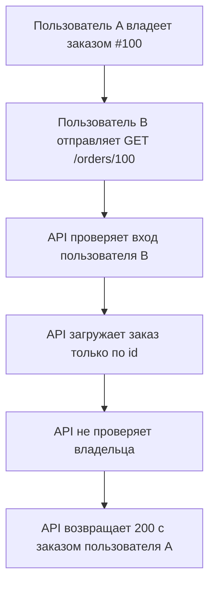
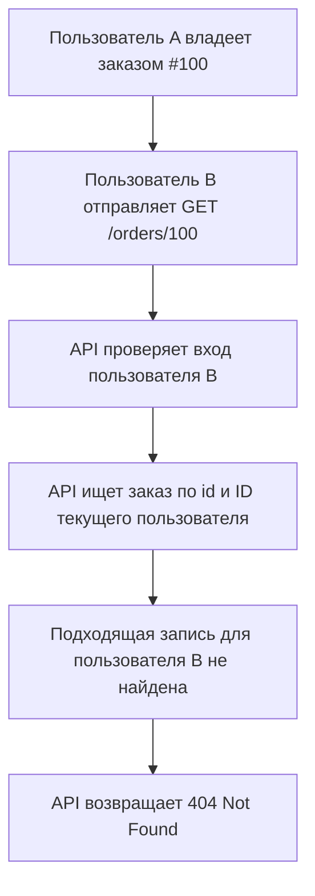

<p align="right">
  <a href="README.md">English</a> |
  <a href="README.ru.md">Русский</a>
</p>

# Пользователь может прочитать заказ другого пользователя

## Краткое описание

Пользователь, который вошел в систему, может прочитать заказ, принадлежащий другому пользователю.

Этот кейс про классическую ошибку авторизации на уровне конкретного объекта: серверный код проверяет, что пользователь вошел в систему, но не проверяет, что запрошенный заказ принадлежит именно этому пользователю.

## Metadata

- ID: `BFL-0001`
- Category: `security-auth`
- Secondary category: `api-http`
- Level: `beginner`
- Technologies: `python`, `fastapi`, `postgresql`, `sqlalchemy`, `pytest`
- Failure modes: `data-leak`, `broken-authz`
- Status: `released`

## Проблема

В API есть маршрут для чтения заказа по ID. В сломанной реализации сервер загружает заказ из базы данных и возвращает его любому пользователю, который вошел в систему.

Проверка входа есть, но проверки прав доступа недостаточно. Код не проверяет, что `order.user_id` совпадает с ID текущего пользователя.

Из-за этого один пользователь может получить приватные данные заказа другого пользователя, если угадает или узнает ID заказа.

## Почему это происходит в боевой среде

Такая ошибка часто появляется, когда разработчики считают вход в систему достаточной защитой для данных конкретного пользователя.

Это особенно часто встречается, когда:

- маршруты используют простые числовые ID;
- сервисные функции загружают записи только по первичному ключу;
- проверки прав доступа сделаны непоследовательно в разных маршрутах API;
- тесты проверяют успешный доступ, но не проверяют доступ к данным другого пользователя;
- API быстро растет, а правила владения данными остаются неявными.

## Сценарий бага

1. Пользователь A владеет заказом `order_a`.
2. Пользователь B вошел в систему.
3. Пользователь B отправляет `GET /orders/{order_a.id}`.
4. Сервер загружает заказ по ID.
5. Сервер возвращает заказ пользователя A пользователю B.

Проблема не в том, что запрос анонимный. Проблема в том, что запрос выполнен пользователем, которому этот заказ не принадлежит.

## Сломанная реализация

Сломанный код проверяет только наличие действительной сессии или токена.

По смыслу он делает вот это:

```python
order = get_order_by_id(order_id)
return order
```

Но в нем не хватает правила:

```python
order.user_id == current_user.id
```

Исправление должно сделать проверку владельца частью серверной логики, а не предположением на стороне клиентской части.

## Где именно происходит ошибка

Ошибка происходит на границе между проверкой входа пользователя и чтением данных из базы.

В `broken/app.py` маршрут читает `current_user_id` из заголовка `X-User-Id`. Это показывает, кто делает запрос, но дальше это значение не используется при загрузке заказа:

```python
_ = current_user_id
order = get_order_by_id(session=session, order_id=order_id)
```

Затем `broken/repository.py` загружает заказ только по `order_id`:

```python
select(Order).where(Order.id == order_id)
```

Такой запрос отвечает только на один вопрос: существует ли заказ с таким ID?

Он не отвечает на главный вопрос безопасности: принадлежит ли этот заказ текущему пользователю?

Поэтому маршрут может вернуть `200 OK` пользователю B, хотя заказ принадлежит пользователю A. Проверка входа прошла успешно, но проверки прав на конкретный заказ вообще не было.

## Как отлавливать такую ошибку

Сначала ищите маршруты, которые принимают ID ресурса и возвращают данные конкретного пользователя:

```http
GET /orders/{order_id}
GET /invoices/{invoice_id}
GET /profiles/{profile_id}
```

Потом проследите запрос в трех местах:

1. Где определяется текущий пользователь.
2. Где ресурс загружается из базы данных.
3. Где ресурс возвращается в ответе.

Опасный паттерн выглядит так:

```python
current_user_id = get_current_user_id(...)
resource = get_resource_by_id(resource_id)
return resource
```

Более безопасный вариант:

```python
resource = get_resource_for_user(resource_id=resource_id, user_id=current_user_id)
return resource
```

Хороший регрессионный тест должен использовать двух пользователей. Тесты только на успешный сценарий с одним пользователем обычно не ловят этот класс ошибок.

## Падающий тест

Падающий тест должен создать двух пользователей и заказ, который принадлежит первому пользователю.

Затем тест должен войти в систему как второй пользователь и запросить заказ первого пользователя.

Тест доказывает, что доступ к чужому заказу заблокирован.

В этом кейсе для доступа к чужому заказу используется `404 Not Found`. API не должен раскрывать, существует ли заказ другого пользователя.

Ожидаемое поведение:

- если заказа не существует, вернуть `404 Not Found`;
- если заказ существует, но принадлежит другому пользователю, вернуть `404 Not Found`;
- если заказ принадлежит текущему пользователю, вернуть `200 OK`.

## Диагностика

Система ломается, потому что проверка прав доступа отвечает не на все нужные вопросы.

`is_authenticated` отвечает только на один вопрос: кто делает запрос?

Для этого маршрута нужен еще один вопрос: имеет ли этот пользователь право читать именно этот заказ?

Для ресурсов, принадлежащих пользователю, серверный код должен проверять права доступа на уровне конкретного объекта. Без такой проверки любой маршрут, принимающий ID ресурса, может стать источником утечки данных.

## Исправленная реализация

Исправленная реализация должна загружать заказ с учетом текущего пользователя или явно проверять владельца до возврата данных.

Предпочтительная форма:

```python
order = get_order_for_user(order_id=order_id, user_id=current_user.id)
```

Так правило доступа находится рядом с кодом, который читает данные из базы. Конфиденциальные данные не возвращаются до проверки прав.

## Как запустить

Из корня репозитория:

### Сломанная версия

```bash
make broken CASE=BFL-0001
```

Ожидаемо: тест должен упасть, потому что сломанная реализация возвращает заказ User A пользователю User B.

### Исправленная версия

```bash
make fixed CASE=BFL-0001
```

Ожидаемо: тесты должны пройти, потому что исправленная реализация проверяет владельца заказа.

## Файлы

- `broken/` - намеренно небезопасная реализация
- `fixed/` - исправленная реализация
- `tests/` - тесты, которые показывают ошибку и проверяют исправление
- `assets/` - Mermaid-диаграммы

## Диаграммы

Сломанный поток:



Исправленный поток:



Эти же диаграммы лежат в файлах:

- [`assets/broken-flow.mmd`](assets/broken-flow.mmd)
- [`assets/fixed-flow.mmd`](assets/fixed-flow.mmd)

## Заметки для боевой среды

В реальной системе такой баг может раскрыть приватные данные пользователя, платежные данные, историю аккаунта, адреса или внутренние бизнес-записи.

Важные практики:

- добавлять тесты на доступ к чужим данным для каждого ресурса, принадлежащего пользователю;
- избегать сервисных функций, которые загружают конфиденциальные записи по ID без учета текущего пользователя;
- логировать попытки запрещенного доступа с request ID, но не логировать приватные данные;
- последовательно использовать `403` или `404` во всем API;
- отдельно проверять списки ресурсов и чтение одного ресурса, потому что данные могут утечь в обоих случаях.

## Компромиссы

`403 Forbidden` явно сообщает клиенту, что доступ запрещен, но подтверждает, что ресурс существует.

`404 Not Found` скрывает существование ресурса, но может усложнить отладку и поведение клиента. В этом кейсе этот вариант выбран намеренно.

Проверять владельца в каждом маршруте просто, но такую проверку легко забыть. Если перенести проверку в слой работы с данными или в сервисные функции, повторения будет меньше, но код должен оставаться понятным и удобным для тестирования.


