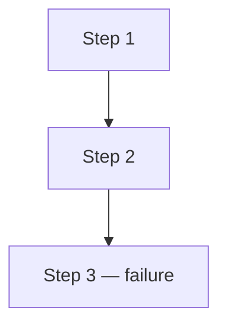
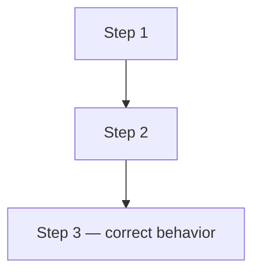

<p align="right">
  <a href="README.md">English</a> |
  <a href="README.ru.md">Русский</a>
</p>

# Case Title

## Summary

Briefly describe the failure scenario and why it matters in production.
One or two sentences are enough.

## Metadata

- ID: `BFL-XXXX`
- Category: `primary-category`
- Secondary category: `secondary-category`
- Level: `junior`
- Technologies: `python`, `fastapi`
- Failure modes: `failure-mode`
- Status: `draft`

## Problem

Describe the broken behavior: what the endpoint does, what it should do,
and what production risk this creates.

## Why This Happens in Production

Explain the conditions that make this bug common in real systems.
List concrete situations where developers introduce this mistake.

## Broken Scenario

Numbered steps that show the failure from the outside:

1. Step 1.
2. Step 2.
3. Step 3 — the bug happens here.

## Broken Implementation

Show the conceptual shape of the broken code. Use short snippets to
illustrate the wrong pattern without quoting the full implementation.

```python
# broken pattern
result = broken_call()
return result
```

## Where the Bug Happens

Point to the specific file and function where the bug lives.
Explain why it breaks at that exact boundary.

Reference the broken files:

```python
# broken/app.py — relevant snippet
```

```python
# broken/repository.py — relevant snippet
```

## How to Catch This Bug

Describe the debugging approach. Show the risky pattern and the safer pattern.

```python
# risky pattern
```

```python
# safer pattern
```

Explain what kind of test catches this class of bug.

## Failing Test

Describe what the failing test sets up and what it asserts.
Explain why the broken implementation fails this test.

## Diagnosis

Explain the root cause. Describe the mental model that leads to the bug
and how to reason from the symptoms to the cause.

## Fixed Implementation

Describe the fix. Show the correct pattern.

```python
# fixed pattern
correct_result = fixed_call()
return correct_result
```

## How to Run

From the repository root:

### Broken Version

```bash
make broken CASE=BFL-XXXX
```

Expected result: this test is expected to fail because the broken implementation ...

### Fixed Version

```bash
make fixed CASE=BFL-XXXX
```

Expected result: the tests should pass because the fixed implementation ...

## Files

- `broken/` - intentionally broken implementation
- `fixed/` - corrected implementation
- `tests/` - tests that demonstrate the failure and verify the fix
- `assets/` - Mermaid diagrams

## Diagrams

Broken flow:



Fixed flow:



The same diagrams are stored in:

- [`assets/broken-flow.mmd`](assets/broken-flow.mmd)
- [`assets/fixed-flow.mmd`](assets/fixed-flow.mmd)

## Production Notes

Describe what happens in a real system when this bug is present.
List monitoring signals, operational concerns, and recommended practices.

## Trade-Offs

Describe what the fix improves and what costs or limitations it introduces.
If multiple fix approaches exist, compare them briefly.
