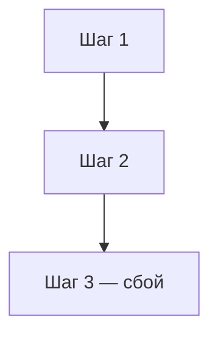
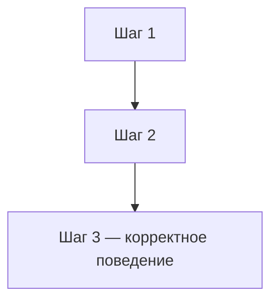

<p align="right">
  <a href="README.md">English</a> |
  <a href="README.ru.md">Русский</a>
</p>

# Заголовок кейса

## Краткое описание

Опишите кратко сценарий сбоя и почему он важен в боевой среде.
Достаточно одного-двух предложений.

## Metadata

- ID: `BFL-XXXX`
- Category: `primary-category`
- Secondary category: `secondary-category`
- Level: `junior`
- Technologies: `python`, `fastapi`
- Failure modes: `failure-mode`
- Status: `draft`

## Проблема

Опишите сломанное поведение: что делает эндпоинт, что он должен делать
и какой риск это создаёт в боевой среде.

## Почему это происходит в боевой среде

Объясните условия, которые делают этот баг распространённым в реальных системах.
Перечислите конкретные ситуации, в которых разработчики допускают такую ошибку.

## Сценарий бага

Пронумерованные шаги, показывающие сбой снаружи:

1. Шаг 1.
2. Шаг 2.
3. Шаг 3 — здесь происходит баг.

## Сломанная реализация

Покажите концептуальный вид сломанного кода. Используйте короткие фрагменты,
чтобы проиллюстрировать неправильный паттерн, не цитируя всю реализацию.

```python
# сломанный паттерн
result = broken_call()
return result
```

## Где именно происходит ошибка

Укажите конкретный файл и функцию, где живёт баг.
Объясните, почему он ломается именно на этой границе.

Ссылайтесь на сломанные файлы:

```python
# broken/app.py — релевантный фрагмент
```

```python
# broken/repository.py — релевантный фрагмент
```

## Как отлавливать такую ошибку

Опишите подход к отладке. Покажите опасный паттерн и более безопасный вариант.

```python
# опасный паттерн
```

```python
# более безопасный вариант
```

Объясните, какой тест ловит этот класс ошибок.

## Падающий тест

Опишите, что настраивает падающий тест и что он проверяет.
Объясните, почему сломанная реализация не проходит этот тест.

## Диагностика

Объясните корневую причину. Опишите ментальную модель, которая приводит к багу,
и как рассуждать от симптомов к причине.

## Исправленная реализация

Опишите исправление. Покажите правильный паттерн.

```python
# исправленный паттерн
correct_result = fixed_call()
return correct_result
```

## Как запустить

Из корня репозитория:

### Сломанная версия

```bash
make broken CASE=BFL-XXXX
```

Ожидаемо: тест должен упасть, потому что сломанная реализация ...

### Исправленная версия

```bash
make fixed CASE=BFL-XXXX
```

Ожидаемо: тесты должны пройти, потому что исправленная реализация ...

## Файлы

- `broken/` - намеренно сломанная реализация
- `fixed/` - исправленная реализация
- `tests/` - тесты, которые показывают ошибку и проверяют исправление
- `assets/` - Mermaid-диаграммы

## Диаграммы

Сломанный поток:



Исправленный поток:



Эти же диаграммы лежат в файлах:

- [`assets/broken-flow.mmd`](assets/broken-flow.mmd)
- [`assets/fixed-flow.mmd`](assets/fixed-flow.mmd)

## Заметки для боевой среды

Опишите, что происходит в реальной системе при наличии этого бага.
Перечислите сигналы мониторинга, операционные проблемы и рекомендуемые практики.

## Компромиссы

Опишите, что улучшает исправление и какие затраты или ограничения оно вносит.
Если существует несколько подходов к исправлению, кратко сравните их.
